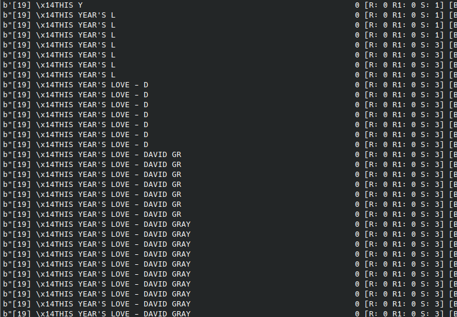
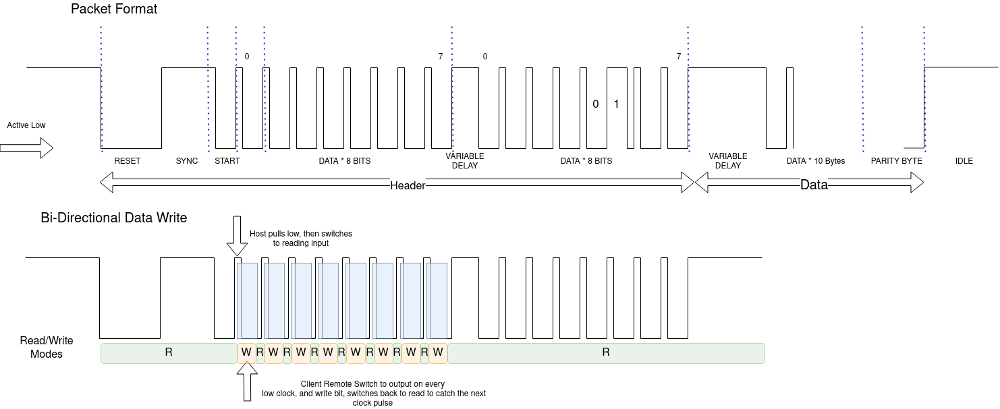

# Sony Minidisc Remote Control Client and Host Library

Barry Carter 2022 <barry.carter@gmail.com>

## What is it?

An arduino libray and supporting example skeches to allow interface to and from Sony LCD Remote control interfaces.

**Supported features are:**
 * Emulate an LCD remote control plugged into a compatible device
 * Emulate a host and control an LCD remote control
 * Emulate CD->MD "joint text" connection using RK-TXT1 link cable emulation to allow track titling and breaks (supported MD devices only, i.e. MZ-R90/1)
 
**Base features:**
 * A recv client. listen to a MD/CD player host
 * A send client. Control a LCD remote control
 * A library to recieve and parse commands into a "friendly" high level interface
 * A Joint text host sender lib

**Tested On Devices:**
 * MZ-R90/91
 * MZ-R55
 * MZ-R70
 
**With Remotes:**
 * RM-MZR55
 * RM-MZ2S



### Use Cases?
Who knows, my use case is kinda niche. 1) I was curious about the protocol, I might not have a use for this. 2) I May want to integrate this into a cyberdeck device in the future.
Here are some other ideas:
 * Build a slick little display for an existing Sony device
 * Intercept the display text and track details, change them on the fly and create hilarity with your friends! (okay, this is a stretch)
 * get a bluetooth uart and make a mobile phone display worthy of yesteryear! Who needs a smart watch!
 
## Display Protocol



### Wire Protocol
The protcol is surprisingly sort of bi directional, in that the client device (the remote control)  can plant a byte of data into the host device for processing. This allows the remote control to request different display modes, text and a couple of other noted features.
 
The protocol is carried out on a single wire interface (plus power +, -)
The single pin is responsible for sync, tri-state handshaking and data payload.
 
The protcol itself is quite basic, at least in basic mode....

8 bits per byte, active low
 
### Basic mode:
 [Sync][High][Start Bit][Data Byte 0*][Data Byte 1]..... [optional 10 byte Payload]
 
 * The first byte is special, as the protocol goes into a tri-state, i.e. the host becomes an input.
 However it does this only between clock pulses. There is more on this later

You can live life entirely in this mode if you don't need text

### Not so basic 
"Did I just move from classical physics to the quantum realm?"
 
When you realise the protocol is actually bidirectional, there is simultaneous elation and immediate dismay. What can of worms did I just open?
Well friends, here is the basis for the Sony Remote Quantun realm.
 
During the first byte of the header, after each clocked LOW pulse, the host goes into input mode.

This allows you to write 1 byte of data to the host while it is clocking.
(achieved in software with some speedy toggling from output to input, ala i2c)
 
``` The handshake sequence is like this:
 Host Mode:     [O][ ][ ][I]
 Host Level:    [H][L][ ][ ]
 Remote Mode:   [I][ ][O][ ]
 Remote Level:  [ ][ ][ ][H]
 
 O = output, I = Input, H = High, L = Low
```
The host device continually writes a header byte, this presumably serves 2 purposes:
 1) sync, i'm still here
 2) opportunity for the client remote to ask for data from the host device
 

**Reading from the device**

When you write to certain registers (e.g. capabilities), the remote device will go into TX mode, where it will start sending data back. 

This is generally done in two transactions, as follows:

 * Write (e.g.) 0x01 to device
 * Write SYNC NOP
 * if remote device has TX ready flag set, set BUS AVAILABLE
 * For 10 bytes + parity: (it follows the same logic as reading the remote's header)
    * Pulse low
    * Set to read mode and read value from host
 
### What do you write?
Emulating a host device, the headers are as follows

 * Request first/next block of text (if the track is long, you can only get it in 7 byte increments). Once you have all of the text, no more is sent and the display command not updated
 * Display of track number in text
 * Request the text display in a loop forever
 * crash the minidisc player (bonus feature?)
   
This could be quite a useful feaure to control...
If you are running out of processing time, you can request the text, stop requesting while you process the first block, request the next chunk etc. This is exactly how the real remote works when paging in really long titles.

Remote to host bits (when you are a remote, byte 0)

| Bit  | Purpose               |
|------|-----------------------|
| 0    |                       |
| 1    | Ready for text        |
| 2    | Display Timer         |
| 3    |                       |
| 4    | Request TX from remote to host |
| 5    |                       |
| 6    | Keep sending text?    |
| 7    | Initialized and ready |


Host to remote bits (when you are a remote, byte 1)

| Bit  | Purpose               |
|------|-----------------------|
| 0    | Data to follow Active Low) |
| 1    |                       |
| 2    |                       |
| 3    |                       |
| 4    | Bus Available         |
| 5    |                       |
| 6    |                       |
| 7    | Initialized and ready |


The remote device has the ability to requst TX of data. The general sequence is as follows:
 * Remote "Set Request TX"
 * Host reponds with "Bus Available" and unsets "data to follow"
 * for each byte: (and parity)
    * Host sends a Start pulse
    * Remote writes byte
 

### Communication Protocol
The procol itself is really simple. All little endian, nothing to twiddle.
After the header, the protocol is formatted as follows:

[Command Byte][Data Payload][Parity CRC]

Some commands have a subcommand, such as text.

### Commands
| ID   | Purpose     | Notes                         |
|------|-------------|-------------------------------|
| 0x01 | Capabilities| Host asks the device about Capabilities |
| 0x03 | Disp Clear? | Sets display mode             |
| 0x04 |             |                               |
| 0x05 | Backlight   |   0x7F = on                   |
| 0x40 | Volume      |                               |
| 0x41 | Play Mode   |                               |
| 0x42 | Rec Mode    |                               |
| 0x43 | Battery     |                               |
| 0x46 | EQ          |                               |
| 0x47 | Alarm       |                               |
| 0xA0 | Track       |                               |
| 0xA1 | Play State  |                               |
| 0xA2 | Display Mode|                               |
| 0xC8 | Text        |                               |

In Joint Text link mode:

| ID   | Purpose           | Notes                         |
|------|-------------------|-------------------------------|
| 0x18 | Get Register      |   Get a register to write to  |
| 0xD8 | Set Track Count?  |  Sets the track value 0x11    |
| 0xD9 | Set Track Break   |  Adds track break             |

#### Device Capabilities
Each device has a capability set. These describe the remote device, such as number of characters, serial number etc.

When the host sends a capability request, the device is expected to write the result back on the next data cycle

**Here are the known capabilities**

**Bank 1**

| ID   | Purpose     | Notes                                        |
|------|-------------|----------------------------------------------|
| 0x00 | Type        | 0xC0 Remote Control                          |
| 0x01 | Block Id    | Which bank of capabilities are we requesting |
| 0x02 | Char count  |                                              |
| 0x03 | charset bank| Id of the bank for this charset. 0 or 1      |
| 0x04 |             |                                              |
| 0x05 | Lcd Height  |  in px                                       |
| 0x06 | Lcd Width   |  in px                                       |
| 0x07 |             |                                              |
| 0x08 |             |       |
| 0x09 |             |                                              |

**Bank 2**

Second character set storage, e.g. kanji

| ID   | Purpose     | Notes                                        |
|------|-------------|----------------------------------------------|
| 0x00 | Type        | 0xC0 Remote Control                          |
| 0x01 | Block Id    | Which bank of capabilities are we requesting |
| 0x02 | Char count  |                                              |
| 0x03 |             |                                              |
| 0x04 |             |                                              |
| 0x05 | lcd rows    |                                              |
| 0x06 | Protocol V  | Protocol version ID                          |
| 0x07 |             |                                              |
| 0x08 |             |                                              |
| 0x09 |             |                                              |

**Bank 3-4**

Blank

**Bank 5**

Device Serial Number as ASCII. i.e.  "RM-R55G", "RMC AE", "RMC01B", "RMC02D"

**Bank 6**

Device Type

4 bytes of text

 * "COM " (MZ-N1, N707, N505, R910, R909, R900, R700, E909, E707, E606W, E505)
 * "MD  " (MZ-R55, 70, 90, 91 devices)

#### Volume
| ID   | Purpose     | Notes                         |
|------|-------------|-------------------------------|
| 0x00 | Volume Level| when < 32 this is the volume  |
| 0x01 | ?           | ?                             |
| 0x02 | Volume Level| Volume level when 0x00 = 0x40 |

Voume is contained in byte 0. When byte 0 = 0x40, then display existing volume in byte 2


#### Track
4 bit encoded. Low bits are units, high bits tens

| ID   | Purpose     | Notes                         |
|------|-------------|-------------------------------|
| 0x03 | Track       | hundreds                      |
| 0x04 | Track       | ones and tens 4 bits each     |


#### Play Mode
see .h file for more, but contains shuffle, repeat, 1, etc modes

#### Battery
| ID   | Purpose     | Notes                         |
|------|-------------|-------------------------------|
| 0x01 | Battery     | Bit register                  |

Bits

| Bit  | Purpose           |
|------|-------------------|
| 0x00 | Blink Low Batt    |
| 0x01 | Power Connected   |
| 0x02 | Charging          |
| 0x03 |                   |
| 0x04 |                   |
| 0x05 | Battery Bar bit 0 |
| 0x06 | Battery Bar bit 1 |
| 0x07 | Powered by batt   |

battery bar count is in bit 5 and 6

i.e. bars = 0x7F & (val >> 5)

#### Text
| ID   | Purpose     | Notes                         |
|------|-------------|-------------------------------|
| 0x01 | Sub Cmd     | 0x01, text done. 0x02, more text  |
| 0x02 |             |  0x01, 0x02, 0x80 observed in ROM   |
| 0x03 | Text        |   Text Payload -  7 chars     |

Subcommand 

* = 2 means more text coming
* = 1 means last chuck of text

0x02 Type
* = 0x01 Host sender mode (when in joint text sync
* = 0x02 seem in firmware, not sure
* = 0x80

If the text starts with:

| ID   | Purpose     | Notes                         |
|------|-------------|-------------------------------|
| 0x20 | Space       | It is usually a time code ** (unless you start a track with a space) |
| 0x04 | Title Icon  |  Title to follow              |
| 0x14 | Track Icon  |  Track to follow              |

Text should be sent when the TEXT READY flag is set on the receiving end

#### Parity
The usual running XOR affair. Nothing special here. Move along.

## "Library"
There are three parts to this arduino sketch
1) A protocol receiver and decoder. This will listen to the desired pin, wait for a packet and then process it. Once processed, a callback is called with the 10 bytes of the packet (assuming it passes parity crc)
2) A protocol sender. This lets you fill raw data into the 10 byte buffer, and send it off to the device. Quite raw.
3) a class library to wrap the two above scripts together. The library processes the incoming packets into plain variables "volume, track" etc. Additionally you can call _send(); functions to send the stored variable data to the minidisc remote control display.

The library can be used with or without sending or receiving. Typically I would imagine you will only one to do one of the two functions at a time.

In pure send more, you can manually set values, i.e. "md_set_track(50);" and then immediately send them to the display using "md_send_track();"
```
 You need to send in a reasonably defined way.
 some_lcd_commands();
 md_loop();
```
calling md_loop is important to ensure we are sending sync packets as well as reading any updates from the device

### Notes:
* The library blocks as it polls or sends. This might not leave you much processing time.
* The library will only start processing once the start bit is detected.
* There are callbacks for processing each packet. This is a good place to to per-packet processing  or custom updates. Not the best place for heavy logic
* This library is a while weekend of effort. i.e. it's pretty crap and un-optimised.

 
## TODO
 * Track needs hundreds adding
 * Finish prototype code to press buttons on the MD player using analogWrite
 * I suppose I should add the read compliment to the above
 
## How did you figure out the protocol?
(for my memory)

With an oscilloscope, a Teensy, and a pot of coffee.

First I looked at it on the scope. Pretty simple.

Then I wrote two programs:
 1) MdRawDump. This script times the high low pulses from the MD and writes them to serial. Really basic, really quick
 2) MdParser.py  This reads the pulses, reconstructs them into data packets and parses them into known data. Similar to the library above!
 
Once I had a realtime pc tracking app, I could iterate on the data coming through. poke a button, observe, rinse repeat. Drink coffee, swear, ponder and code.

Figuring out the bi-directional nature to get the text was a little more challenging and required a reasoned try it and see approach. The theory that something was going on with that first byte paid out. The first byte had a sloping fall time to it, not a nice sharp pulse like you would expect. It looked a lot like it went open drain.... A few moments later and some terrible hacky code, the text was flowing!

# Credits
Way too late into this project I found this repo: 
 * https://github.com/xunker/SonyMDRemote by Matthew Nielsen. A great resouce that backs up a lot of my observations and adds some things to my TODO list. (like, really I totally forgot track count could be > 99... derp)
 While totally awesome, some information here superceeds it (although not as amazingly documented as Matthew did)
 * Ringtons Coffee. Damn good stuff and get me through the weekend of research.
 * Big credits to the oscope for leading me to the conclusion this was a bidirectional protocol. A few resistors hanging off the board really highlighted that open drain slope like a digital circuit could (and did) not.
 * Breaking news: Credit to https://minidisc.wiki and the discord community ho have been working on this for a while
 * Asivery for a similar implementation https://github.com/asivery/Sony-Inline-Remote-Emulator
 * Ryan "Izzy" Bales for the traces of other remotes that helped clarity a few points. https://raw.githubusercontent.com/izzy84075/md_sigrok_decoders
